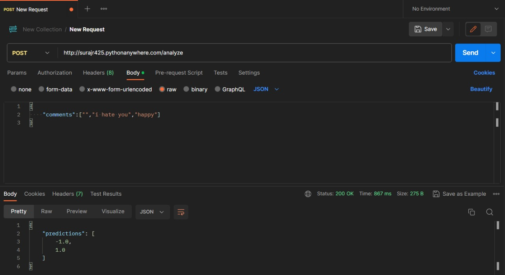

# Social Pulse: Sentiments on Social Media Platforms


## Description
The Social Media Sentiment Analysis Project is a web-based tool designed to analyze the sentiment of social media posts provided by users. Its main purpose is to help users understand the emotional tone of a given post by categorizing it as positive (1), negative (-1), or neutral (0). By analyzing the sentiments expressed in social media content, individuals and organizations can gauge the overall sentiment trends, identify potential issues, and take appropriate actions to maintain or enhance their online presence. The project processes the input link, extracts the text content, performs sentiment analysis, and presents the results through intuitive visualizations such as pie charts. Users can gain valuable insights into the sentiment of social media content, making it a valuable tool for understanding public opinion and trends on various platforms.

## Usage
- **Brand Reputation Management**: Companies & individuals can use sentiment analysis to monitor how their brand is perceived on social media.
- **Customer Feedback Analysis**: Businesses can track customer sentiment expressed in social media posts and comments. This information can be used to improve products.
- **Competitor Analysis**: Understanding how competitors are perceived on social media can provide a competitive advantage. Sentiment analysis can help companies benchmark their own sentiment against that of their competitors.


## Demo
ss to be attached

## Getting Started

To use this project, follow these steps:

Clone the repository to your local machine:

```bash
git clone https://github.com/ITER-SIH/Team-38.git
cd Team-38
cd senti-bot
npm install
npm start
```

- Ensure that you have Node.js and npm installed on your machines before running `npm install`.

## Technology Stack
  

 


## Backend API Documentation

### Endpoint

- **URL**: `http://surajr425.pythonanywhere.com/analyze`
- **Method**: POST

## Request

- **Content-Type**: `application/json`

### Request Body

```
{
  "comments": []
}
```
**comments**: An array of comments for sentiment analysis.
## Response
- **Content-Type**: `application/json`
### Response Body
```
{
  "predictions": []
}
```
**predictions**: An array of sentiment predictions for the provided comments. Each prediction can be one of the following:
0: Neutral sentiment.
-1: Negative sentiment.
1: Positive sentiment.-

## Example



## Model Exportation
To export and deploy our machine learning model, we have followed these steps:

- **Jupyter Notebook Development**: We developed and trained our machine learning model within a Jupyter Notebook environment. The notebook contains the code for data preprocessing, model training, and evaluation.

- **Pickle File**:
  - After training the model, we save it as a .pkl (Python Pickle) file. This step ensures that the trained model can be easily loaded and utilized in other Python scripts and applications.
  - Additionally, we save the vectorizer used for feature transformation as a separate .pkl file. This vectorizer is essential for preprocessing input data before making predictions with the model.


- **Flask Backend Server**: Our Flask server loads the saved model and vectorizer during initialization, making them ready for inference. Flask backend of the project is hosted and deployed on [PythonAnywhere](https://www.pythonanywhere.com/), a cloud-based Python web hosting service. PythonAnywhere makes it easy to run Python web applications and servers in the cloud.


## Contributors
- [Arun Kumar Sahoo](https://www.github.com/arunsahoo-xt)
- [Ihit Chakraborty](https://www.github.com/ihitchak)
- [Sneha Rani](https://github.com/rani-sneha)
- [Sibasis Dash](https://github.com/sibasis828)
- [Suraj Raj](https://github.com/suraj-fusion)
- [Sukriti Kuila](https://www.github.com/sukriti-kuila)
